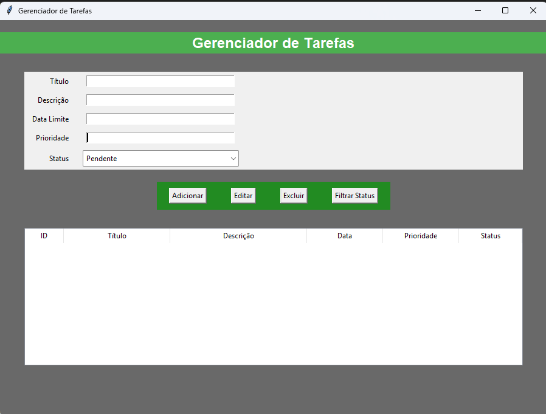

# 📋 Gerenciador de Tarefas com Interface Gráfica

Este projeto é um **Gerenciador de Tarefas** com interface em **Tkinter (Python)**, integração com banco de dados **PostgreSQL** e sistema de **notificações de prazos próximos**. Ele permite adicionar, editar, excluir, filtrar e listar tarefas de forma simples e intuitiva.

## 🛠 Funcionalidades

- ✅ Adicionar nova tarefa
- 📝 Editar tarefa existente
- ❌ Excluir tarefas
- 🔎 Filtrar tarefas por status (Pendente ou Concluída)
- 📅 Notificações de tarefas com prazo próximo (hoje ou amanhã)
- 📊 Interface gráfica moderna com tabela para visualização
- 🎨 Interface amigável com estilo personalizado

## 🖼 Captura de Tela



## 🐍 Tecnologias Utilizadas

- Python 3.x
- Tkinter
- ttk (estilização de interface)
- PostgreSQL
- datetime (verificação de prazos)
- messagebox (avisos e alertas)

## 🧩 Estrutura do Projeto

```
gerenciador_tarefas/
├── database.py            # Conexão com o banco de dados PostgreSQL
├── interface.py           # Interface gráfica principal usando Tkinter
├── tarefas.py             # Funções para gerenciar tarefas (CRUD)
├── notificacoes.py        # Sistema de verificação de prazos e alertas
├── README.md              # Documentação do projeto
└── screenshot.png         # Imagem da interface (opcional)
```

## 🧠 Como Usar

1. **Clone o repositório**:
   ```bash
   git clone https://github.com/seu-usuario/gerenciador-tarefas.git
   cd gerenciador-tarefas
   ```

2. **Instale as dependências**:
   ```bash
   pip install psycopg2
   ```

3. **Configure o banco de dados** no arquivo `database.py`:
   ```python
   def conectar():
       return psycopg2.connect(
           dbname='nome_do_banco',
           user='seu_usuario',
           password='sua_senha',
           host='localhost',
           port='5432'
       )
   ```

4. **Crie a tabela no banco** (caso ainda não exista):
   ```sql
   CREATE TABLE tarefas (
       id SERIAL PRIMARY KEY,
       titulo VARCHAR(255) NOT NULL,
       descricao TEXT,
       data_limite DATE NOT NULL,
       status VARCHAR(20) DEFAULT 'Pendente'
   );
   ```

5. **Execute o sistema**:
   ```bash
   python interface.py
   ```

## 📅 Notificações de Prazos

Sempre que o sistema for iniciado, ele irá verificar se existem tarefas com prazo **para hoje ou amanhã**. Se houver, um alerta será exibido com o título da tarefa.

## 📄 Licença

Este projeto está licenciado sob a licença **MIT**. Veja o arquivo [LICENSE](LICENSE) para mais detalhes.

## 🤝 Contribuindo

Contribuições são bem-vindas! Se você deseja melhorar o projeto:

1. Fork este repositório.
2. Crie uma branch com sua feature: `git checkout -b minha-feature`
3. Commit suas mudanças: `git commit -m 'Adiciona nova funcionalidade'`
4. Push para a branch: `git push origin minha-feature`
5. Abra um Pull Request

---

Desenvolvido com 💻 e ☕ por [alanbazilik](https://github.com/alanbazilik/Sistema-Gerencimento-de-tarefas)
